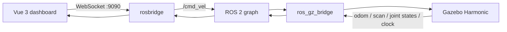

# RoboPilot

RoboPilot is a browser-controlled differential-drive robot simulation built with **ROS 2 Jazzy**, **Gazebo Harmonic**, and **Vue 3**.

It is designed as a practical first robotics project: launch a simulated robot, drive it from a web dashboard, inspect odometry and laser scans, and then extend the same software architecture toward SLAM, autonomous navigation, and real hardware.

## What is included

- Differential-drive robot described with URDF/Xacro
- Gazebo Harmonic simulation world with obstacles
- 2D lidar, wheel joints, odometry, TF, and simulated clock
- ROS ↔ Gazebo topic bridge
- rosbridge WebSocket endpoint for browser clients
- Vue 3 dashboard with keyboard and touch controls
- Live odometry and lidar visualization
- Dead-man stop, speed limits, blur protection, and emergency stop
- Ubuntu 24.04 and Windows 11 + WSLg setup guides
- ROS package build checks and dashboard CI

## Architecture



## Requirements

Recommended development environment:

- Ubuntu 24.04, either native or through Windows 11 WSL2 with WSLg
- ROS 2 Jazzy Desktop
- Gazebo Harmonic / `ros_gz`
- Node.js 20 or newer
- Python 3

## Quick start

### 1. Clone and install dependencies

```bash
git clone https://github.com/weepwood/RoboPilot.git
cd RoboPilot
chmod +x scripts/*.sh
./scripts/bootstrap_ubuntu.sh
```

Restart the shell after the bootstrap script finishes, or source ROS manually:

```bash
source /opt/ros/jazzy/setup.bash
```

### 2. Build the ROS workspace

```bash
./scripts/build_ros.sh
```

### 3. Start the simulation

```bash
./scripts/run_sim.sh
```

Gazebo and RViz should open. The launch process also starts rosbridge on port `9090`.

### 4. Start the dashboard

Open another terminal:

```bash
./scripts/run_dashboard.sh
```

Open the address printed by Vite, normally `http://localhost:5173`.

## Controls

| Action | Keyboard | Dashboard |
| --- | --- | --- |
| Forward | `W` or `↑` | Up button |
| Backward | `S` or `↓` | Down button |
| Turn left | `A` or `←` | Left button |
| Turn right | `D` or `→` | Right button |
| Stop | `Space` | Stop button |
| Emergency stop | — | Red E-STOP button |

The dashboard publishes commands only while a control is held. Releasing the key/button, changing browser tabs, losing window focus, or disconnecting sends a zero-velocity command.

## Useful commands

```bash
# Inspect nodes and topics
ros2 node list
ros2 topic list

# Watch velocity commands
ros2 topic echo /cmd_vel

# Watch odometry
ros2 topic echo /odom

# Watch one lidar message
ros2 topic echo /scan --once

# Drive without the dashboard
ros2 run teleop_twist_keyboard teleop_twist_keyboard
```

## Main ROS topics

| Topic | Type | Direction | Purpose |
| --- | --- | --- | --- |
| `/cmd_vel` | `geometry_msgs/msg/Twist` | ROS → Gazebo | Linear and angular velocity command |
| `/odom` | `nav_msgs/msg/Odometry` | Gazebo → ROS | Simulated wheel odometry |
| `/scan` | `sensor_msgs/msg/LaserScan` | Gazebo → ROS | 2D lidar scan |
| `/joint_states` | `sensor_msgs/msg/JointState` | Gazebo → ROS | Wheel joint state |
| `/tf` | `tf2_msgs/msg/TFMessage` | Gazebo → ROS | Dynamic transforms |
| `/clock` | `rosgraph_msgs/msg/Clock` | Gazebo → ROS | Simulation clock |

## Project layout

```text
RoboPilot/
├── dashboard/                 # Vue 3 browser control center
├── docs/                      # Architecture and platform guides
├── scripts/                   # Bootstrap, build, and run helpers
├── src/robopilot_sim/         # ROS 2 simulation package
│   ├── config/                # ros_gz bridge configuration
│   ├── launch/                # Combined simulation launch file
│   ├── rviz/                  # RViz display configuration
│   ├── urdf/                  # Robot Xacro model
│   └── worlds/                # Gazebo world
└── .github/workflows/         # Manual and pull-request CI
```

## Launch options

```bash
ros2 launch robopilot_sim simulation.launch.py \
  use_rviz:=true \
  use_rosbridge:=true \
  world:=training_world.sdf
```

Set `headless:=true` for a server-only Gazebo process:

```bash
ros2 launch robopilot_sim simulation.launch.py headless:=true use_rviz:=false
```

## Windows

Use WSL2 with Ubuntu 24.04 and WSLg rather than installing the Linux simulation stack directly into Windows. See [docs/WINDOWS_WSL2.md](docs/WINDOWS_WSL2.md).

## Next milestones

1. Add SLAM Toolbox and map persistence
2. Add Nav2 localization and point-and-click navigation
3. Add camera simulation and browser video streaming
4. Add mission waypoints and patrol mode
5. Replace the simulated drive plugin with an ESP32 or STM32 hardware bridge

## License

MIT
