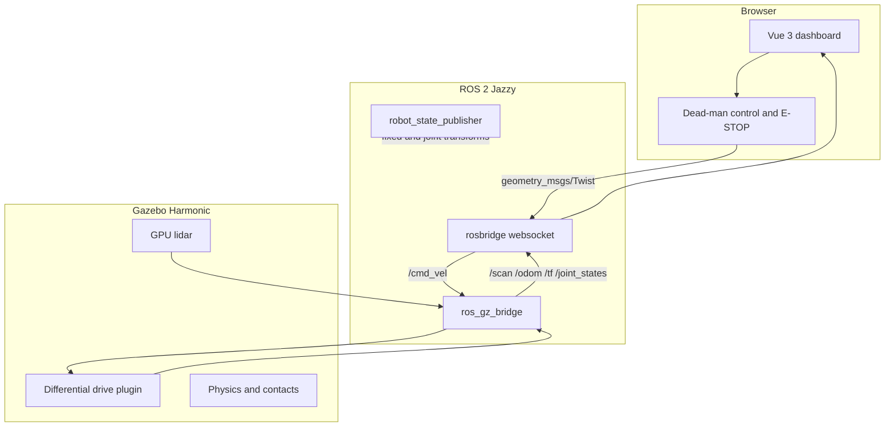

# RoboPilot architecture

## Design goal

RoboPilot intentionally separates high-level user interaction from robot control and simulation. The browser never talks to Gazebo directly. It publishes and subscribes to ROS 2 topics through rosbridge, while `ros_gz_bridge` translates between ROS 2 messages and Gazebo Transport messages.

## Runtime components

### Robot description

`src/robopilot_sim/urdf/robopilot.urdf.xacro` defines the chassis, wheels, caster, lidar, inertial data, collision geometry, and Gazebo plugins. Xacro keeps geometric constants such as wheel radius and separation in one place.

### Simulation world

`training_world.sdf` is fully local: it does not depend on Gazebo Fuel models or an internet connection. It contains a ground plane, boundary walls, and several obstacle shapes suitable for manual driving and lidar inspection.

### ROS-Gazebo bridge

`config/bridge.yaml` explicitly defines every bridged topic. Explicit direction prevents accidental bidirectional loops:

- `/cmd_vel`: ROS to Gazebo
- `/clock`, `/odom`, `/scan`, `/joint_states`, `/tf`: Gazebo to ROS

### Browser control

The dashboard uses `roslib` over port 9090. Motion commands are sent at 10 Hz only while a control is active. A zero command is sent when input is released, the page loses focus, the browser tab is hidden, rosbridge disconnects, or E-STOP is pressed.

## Extension boundaries

The current system is structured so later features can be added without replacing the first version:

- Add SLAM Toolbox as another ROS 2 node subscribing to `/scan` and `/tf`.
- Add Nav2 and let it become another publisher to the robot velocity command path.
- Insert a velocity multiplexer before `/cmd_vel` when manual and autonomous control coexist.
- Replace the Gazebo differential-drive plugin with a microcontroller bridge while retaining the dashboard and most ROS interfaces.
- Record `/scan`, `/odom`, and commands with rosbag2 for replay and regression tests.

## Safety note for real hardware

The browser-side E-STOP is a software stop and is not sufficient for a physical robot. Real hardware needs an independently wired emergency-stop circuit, motor-driver enable control, command timeout in the embedded controller, current limits, and a safe power system.
